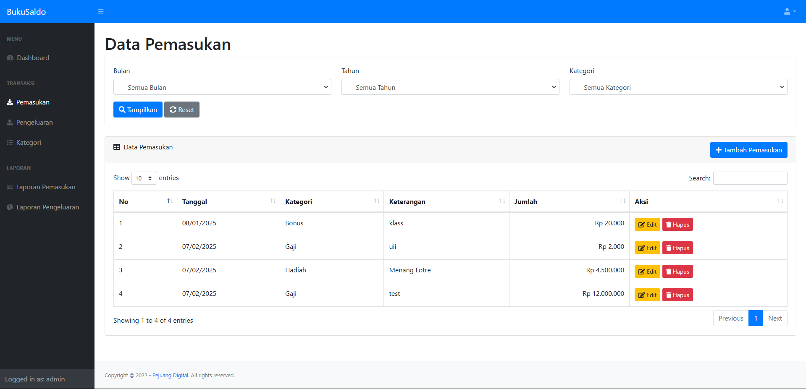

# Aplikasi Manajemen Keuangan Pribadi

## 📌 Deskripsi
Aplikasi Manajemen Keuangan Pribadi adalah aplikasi yang membantu pengguna dalam mencatat pemasukan serta pengeluaran pribadi secara mudah dan efisien.

## ✨ Fitur Utama
- ✏️ **Pencatatan Keuangan**: Pengguna dapat mencatat pemasukan dan pengeluaran mereka.
- 📊 **Laporan Keuangan**: Laporan otomatis berdasarkan data transaksi yang dimasukkan oleh pengguna.
- 🔐 **Autentikasi Pengguna**: Sistem login dan registrasi untuk keamanan data.
- 📝 **CRUD Transaksi**: Pengguna dapat menambah, mengedit, menghapus, dan melihat transaksi keuangan mereka.
- 📅 **Laporan Bulanan**: Rekap keuangan setiap bulan dalam bentuk laporan yang mudah dipahami.

## 📸 Lampiran Halaman
- **Halaman Dashboard** :


- **Halaman Transaksi Pemasukan** :



- **Halaman Tambah Transaksi Pemasukan** :


- **Halaman Edit Transaksi Pemasukan** :


- **Halaman Transaksi Pengeluaran** :


- **Halaman Tambah Transaksi Pengeluaran** :


- **Halaman Edit Transaksi Pengeluaran** :


- **Halaman Kategori** :


- **Halaman Tambah Kategori** :


- **Halaman Laporan Pemasukan** :


- **Halaman Laporan Pengeluaran** :


## 🚀 Instalasi
1. Clone repository ini:
   ```bash
   git clone https://github.com/RafifDwiPrayata/Aplikasi-Manajemen-Keuangan-Pribadi.git
   ```
2. Masuk ke direktori proyek:
   ```bash
   cd nama_proyek
   ```
3. Install dependensi:
   ```bash
   npm install  # atau pip install -r requirements.txt (sesuai teknologi yang digunakan)
   ```
4. Jalankan aplikasi:
   ```bash
   npm start  # atau perintah lain sesuai dengan framework
   ```

## 🛠 Teknologi yang Digunakan
- **Frontend**: HTML / SBADMIN / Bootstrap (versi 4.6.0)-[] / Font Awesome (versi 5.15.3) /DataTables (versi 1.10.20)
- **Backend**: Framework: CodeIgniter 2
- **Database**: MySQL
---
Selamat menggunakan Aplikasi Manajemen Keuangan Pribadi! 💰📈
